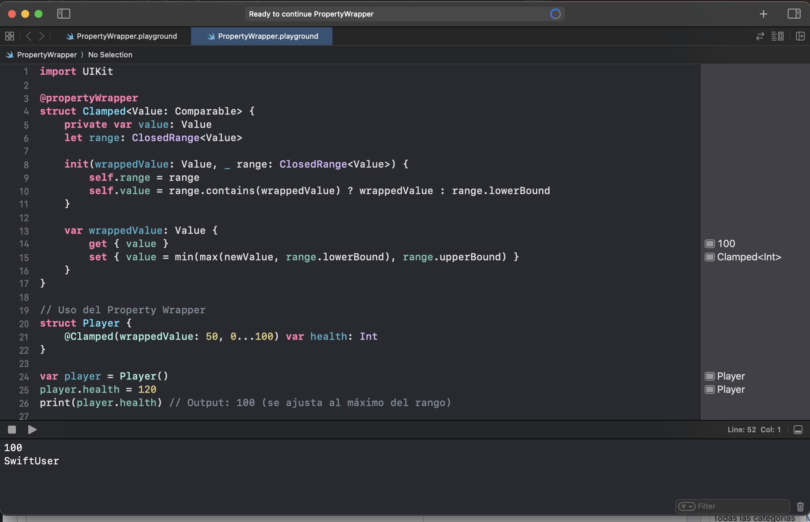

# PropertyWrapper-Playground
Sample iOS playground with examples of @propertyWrapper usage. This code is basecode for following post  [Custom @propertyWrapper in Action](https://javios.eu/swift/custom-propertywrapper-in-action/)

## Screenshots

## Requirements

- **Xcode 15.0 or later**
- **iOS 16.0 or later**
